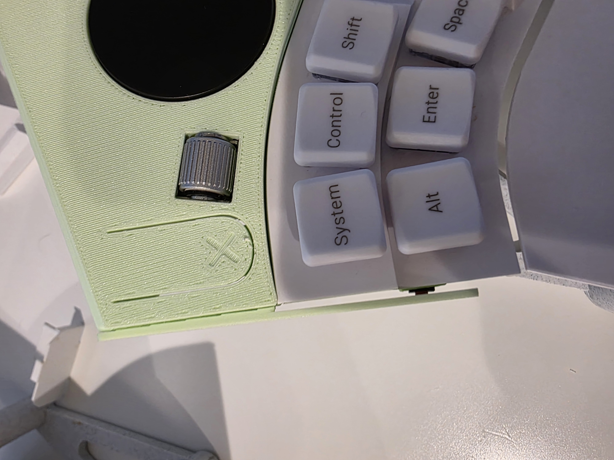
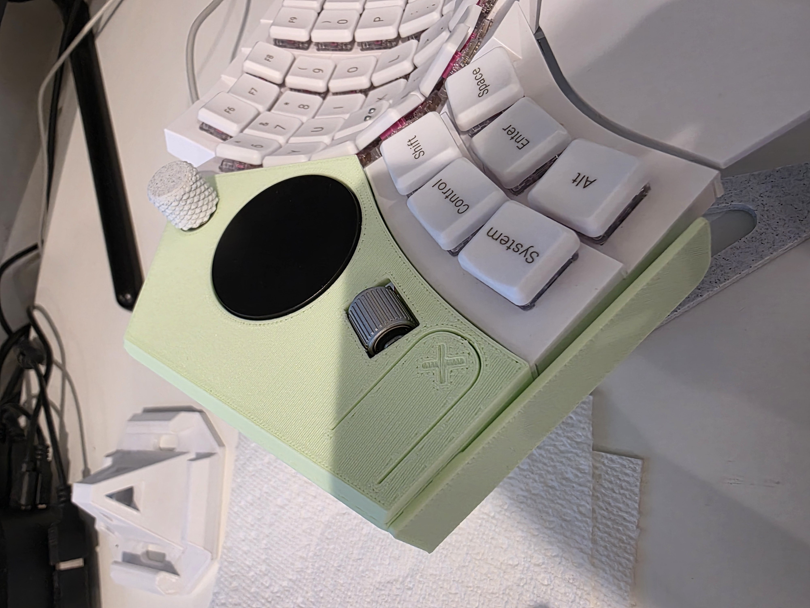

# CustomTouchpad V7 🚀

A DIY ergonomic desktop trackpad module powered by QMK & Vial on a Raspberry Pi RP2040 Pro Micro. Features a 40mm Cirque GlidePoint curved trackpad, dual rotary encoders (volume knob + smooth scroll roller), and customizable status RGB lighting.

[](https://youtube.com/shorts/NrFE-3k1rw0)
[](https://vial.rocks/)

---

## 📸 Photos & Demo Video

| Physical Build | Assembly / Internal Fit | Wiring Diagram |
| :---: | :---: | :---: |
|  |  |  |

🎥 **Video Demonstration**: [Watch the short showcase on YouTube](https://youtube.com/shorts/NrFE-3k1rw0)

---

## 🛠 Features

- **Cirque GlidePoint 40mm Curved Trackpad** (`TM040040-2024-303`) via SPI.
  - Dynamic Touchpad Ballistics (variable speed acceleration: slow finger movements give pixel-perfect fine control, fast flicks traverse multi-monitor setups effortlessly).
  - Sub-pixel precision accumulator to prevent pixel jitter.
  - Native Tap-to-Click, Cursor Glide (inertial flick coasting), Circular Edge Scrolling, and hardware smoothing filter.
  - Dedicated hardware mouse buttons (B1 / B2).
- **Dual Encoders**:
  - **EC11 Rotary Encoder**: Smooth audio volume wheel + push-button mute (`KC_MUTE`) on Layer 0; YouTube / media 5-second skip backward/forward + play/pause on Layer 1.
  - **Panasonic EVQWGD001 Roller Encoder**: Precision vertical / horizontal scrolling with customizable acceleration curves.
- **Multifunction Layer & Anti-Sleep Screensaver**:
  - **Layer 0 (Navigation)**: Default desktop trackpad, scroll wheel, volume knob.
  - **Layer 1 (Media / Productivity)**: Horizontal scrolling, video scrubbing (±5s seek), play/pause.
  - **Layer 2 (Anti-Sleep Screensaver / Mouse Jiggler)**: Long-press the roller button (400ms) to engage undetectable, human-like Bezier curve cursor simulation or geometric patterns (Pong bouncer, Orbit, Lissajous).
- **WS2812B RGB Status LED**: Real-time layer indicators, customizable colors, and auto-idle timeout.
- **Full Vial Integration**: Adjust sensitivity (ADC attenuation), CPI (600–1800), acceleration curves, scroll inversion, and LED colors on the fly via [Vial Web](https://vial.rocks/) without reflashing.

---

## 🧰 Bill of Materials (BOM) & Components

### Electronics & Sensors
| Component | Description | Notes |
| :--- | :--- | :--- |
| **RP2040 Pro Micro** | 3.3V RP2040 Microcontroller Board | USB Type-C recommended (sourced from AliExpress/Amazon) |
| **Cirque GlidePoint TM040040** | 40mm Circular Trackpad (Curved Overlay `TM040040-2024-303`) | SPI interface configuration (remove R1 resistor on trackpad to enable SPI mode) |
| **Panasonic EVQWGD001** | Roller Encoder | Used for primary vertical/horizontal scroll wheel (sourced from AliExpress) |
| **EC11 Rotary Encoder** | Incremental encoder with push button | Knob navigation & volume control (AliExpress/Amazon) |
| **WS2812B SMD LED** | 5050 / 3535 Addressable RGB LED | GP6 data line for status illumination |
| **JST Connectors / Pre-crimped Wires** | JST-SH (1.0mm) or JST-XH/ZH (1.25mm/1.5mm) | **Crucial for assembly**: Allows each component to unplug easily, making final fitting inside the tight enclosure possible |
| **Hookup Wire** | 28 AWG to 30 AWG silicone wire | Flexible stranded wire recommended |

> [!TIP]  
> Most electronic components (RP2040 Pro Micro, Cirque trackpad, EVQWGD001 roller, EC11 encoders, and JST connector kits) can be sourced very affordably from **AliExpress**.

### Fasteners, Inserts & Tools
| Hardware | Item / Link | Notes |
| :--- | :--- | :--- |
| **Heat-Set Threaded Inserts** | [M2.5 Heat-Set Brass Inserts (Amazon)](https://www.amazon.com/dp/B0FWCG2K1F?ref=ppx_yo2ov_dt_b_fed_asin_title&th=1) | Installed into 3D-printed standoffs for durable screw fastening (or AliExpress) |
| **Screws & Nuts Assortment** | [Mxuteuk Metric M2/M2.5/M3 Screws & Nuts Kit (Amazon)](https://www.amazon.com/dp/B0G8F366MV?ref=ppx_yo2ov_dt_b_fed_asin_title&th=1) | M2.5 socket head cap screws used for assembling top and bottom case |
| **Soldering Iron** | [80W Digital Soldering Iron Kit (Amazon)](https://www.amazon.com/dp/B08R3515SF?ref=ppx_yo2ov_dt_b_fed_asin_title&th=1) | Budget adjustable-temp iron suitable for wiring and heat-setting inserts |
| **Allen / Hex Key** | Standard small M2.5 hex wrench (included with screw kit) | Used for driving screws and reaming undersized holes |

---

## 🔌 Pinout & Wiring Diagram

Refer to the wiring schematic in [`Pictures/Touchpad Wiring2.png`](Pictures/Touchpad%20Wiring2.png):

| Component | Pin Function | RP2040 Pro Micro Pin |
| :--- | :--- | :--- |
| **Cirque Trackpad (SPI)** | SCK (Clock) | **GP2** |
| | MOSI (Data In) | **GP3** |
| | MISO (Data Out) | **GP4** |
| | CS (Chip Select) | **GP5** |
| | VCC | **3.3V** |
| | GND | **GND** |
| **Status RGB LED** | DI (Data In) | **GP6** |
| | 5V / VCC & GND | **VBUS (or 3.3V)** & **GND** |
| **Push-Button Switches** | EC11 Button Push | **GP20** (Row 0, Col 0 - Active Low) |
| | Roller Button Push | **GP29** (Row 0, Col 1 - Active Low) |
| **EC11 Rotary Encoder** | Phase A | **GP21** |
| | Phase B | **GP23** |
| | Common Pin | **GND** |
| **Panasonic EVQWGD001 Roller** | Phase A | **GP27** |
| | Phase B | **GP26** |
| | Common Pin | **GND** |

> [!NOTE]  
> The buttons are configured as direct matrix pins (`GP20`, `GP29`). Ensure switches connect between their designated GPIO pin and Ground (`COL2ROW` internal pull-up logic).

---

## 🖨️ 3D Printing & Enclosure Assembly

All enclosure STL models are located in the [`3d Print Files/`](3d%20Print%20Files/) folder:

- `top v3.stl`: Top shell housing the trackpad and encoder openings.
- `Bottom v5.stl`: Base enclosure holding the microcontroller, roller, and wiring.
- `Bottom Cover v1.stl`: Bottom access plate.
- `Clicker v3.stl`: Internal mechanical button lever / pivot.
- `keeper piece.stl`: Retaining bracket for the trackpad/roller assembly.
- `MyKnob.stl`: Custom tactile knob for the EC11 rotary encoder.

### 💡 3D Printing & Assembly Tips:
1. **Undersized Holes (Printer Tolerance)**:  
   The screw holes in the 3D printed files were intentionally modeled slightly undersized to account for different printer tolerances and shrinkage. **You can easily clear / enlarge them to the perfect diameter simply by running through them with the small Allen hex key used for the M2.5 screws.**
2. **Heat-Set Insert Installation**:  
   Set your soldering iron to ~220–250°C (if printing in PLA/PETG). Place an M2.5 brass heat-set insert over each mounting hole, gently press down with the tip of the soldering iron until the insert sinks flush with the plastic rim, then remove the iron and let it cool without disturbing it.
3. **Modular JST Connectors (Crucial for Assembly)**:  
   Because the custom enclosure is compact and tightly integrated, soldering all components directly to the RP2040 board with permanent wires makes mechanical assembly nearly impossible. **Using JST connectors (or pre-crimped JST pigtails) allows each module—trackpad, encoders, LED, and buttons—to be unplugged during installation and snapped together inside the case.**

---

## 💾 Firmware & Flashing

A pre-compiled, ready-to-flash Vial firmware binary is included right in this directory:
📁 **[`custom_touchpad_v7_vial.uf2`](custom_touchpad_v7_vial.uf2)**

### Flashing Instructions:
1. Hold down the **BOOT** button on the RP2040 Pro Micro board and plug it into your computer via USB (or double-tap **RESET**).
2. The board will appear as a removable USB storage drive named `RPI-RP2`.
3. Drag and drop [`custom_touchpad_v7_vial.uf2`](custom_touchpad_v7_vial.uf2) onto the `RPI-RP2` drive.
4. The board will automatically reboot as an HID trackpad and keyboard device.
5. Open [Vial Web App](https://vial.rocks/) or the Vial desktop application in Chrome / Edge to configure layers, sensitivity curves, and RGB settings in real time!

### Compiling from Source (Optional)
If you want to modify keymaps or compile from source within this repository:
```bash
make handwired/bojan/custom_touchpad_v7:vial
```

---

## 🎮 Default Controls & Gestures

### Layer 0: Standard Navigation (Default)
- **Trackpad**: Cursor movement (dynamic velocity acceleration).
- **Single Tap**: Left Click.
- **Top-Right / Outer Perimeter**: Circular Scroll (or roller wheel).
- **EC11 Knob Rotate**: Volume Down / Volume Up.
- **EC11 Knob Click**: Audio Mute / Unmute.
- **EVQWGD001 Roller Scroll**: Accelerated Vertical Page Scroll.
- **EVQWGD001 Roller Click**: 
  - *Short Tap*: Switch between Layer 0 and Layer 1.
  - *Hold (>= 400ms)*: Enter Layer 2 (Anti-Sleep Screensaver).

### Layer 1: Media & Productivity
- **EC11 Knob Rotate**: YouTube / Video seek 5s backward (`KC_LEFT`) / forward (`KC_RIGHT`).
- **EC11 Knob Click**: Play / Pause video (`KC_MPLY`).
- **EVQWGD001 Roller Scroll**: Horizontal scroll (`MS_WHLL` / `MS_WHLR`).
- **EVQWGD001 Roller Click**: Switch back to Layer 0.

### Layer 2: Screensaver / Anti-Sleep Mode
- **EC11 Knob Rotate**: Increase / decrease movement speed (1–10).
- **EVQWGD001 Roller Scroll**: Cycle through 4 animation patterns:
  - *Pattern 0*: Natural Human Simulator (random idle pauses & smooth Bezier curves).
  - *Pattern 1*: Pong / DVD screen bounce.
  - *Pattern 2*: Circular orbit.
  - *Pattern 3*: Lissajous figure-8.
- **Any Button Click or Trackpad Movement**: Automatically wakes and returns to Layer 0.
